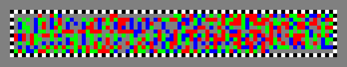
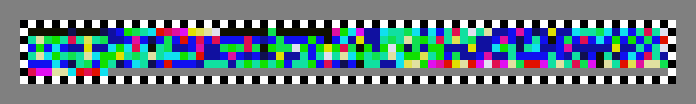
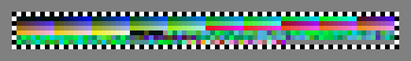
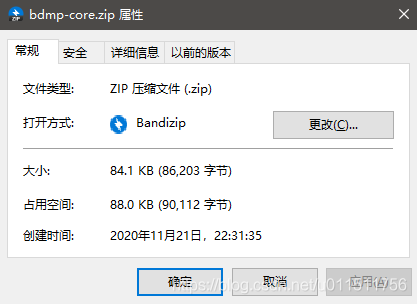
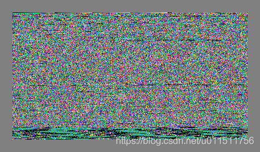
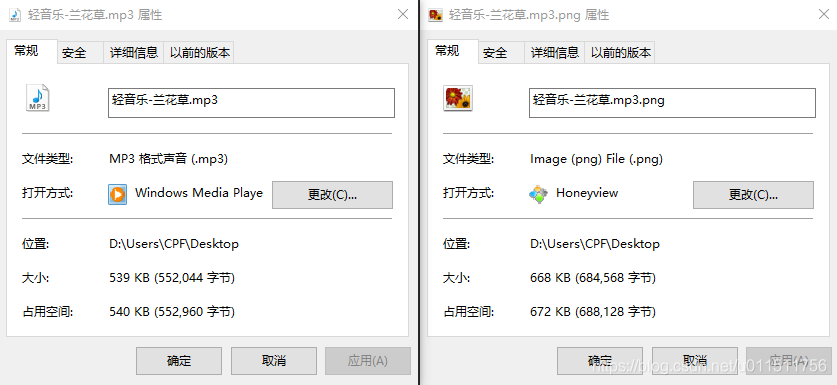
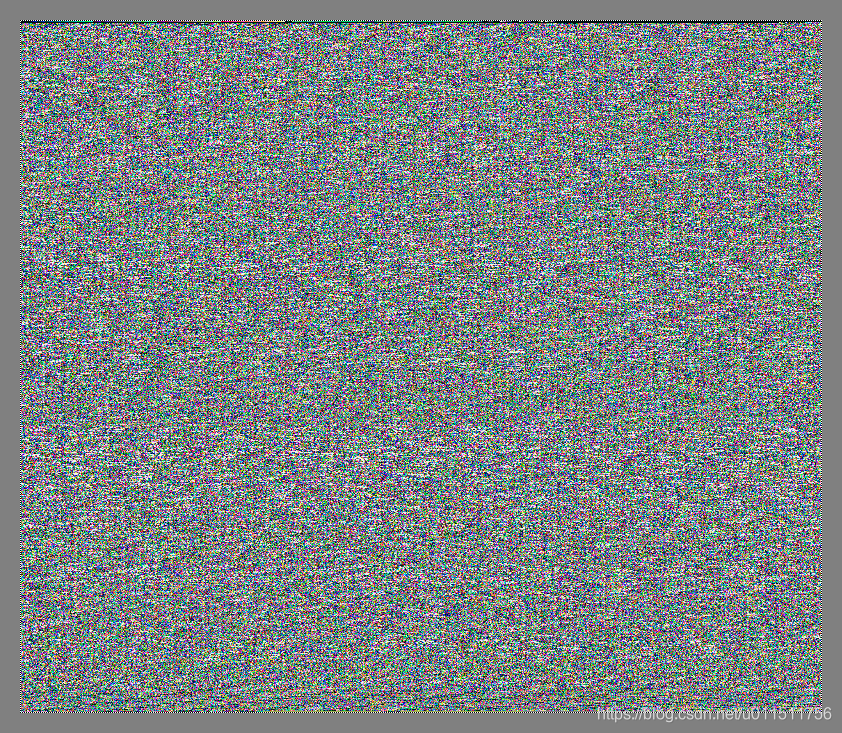

# 二进制数据图片(binary-data-map)

二进制数据图片, 一种以图片信息的形式传递数据的方式

## 前言

最近公司那台终端电脑的粘贴功能坏了, 连接远程想从里面拿一个文件出来, 试了好多种方法不顶用, 远程终端开了一堆程序也不能随便重启远程终端, 最终是关了一大堆不必要的应用, 又重启了下rdpclip.exe解决了

> [Windows服务器远程桌面不能复制粘贴的解决方法](https://www.cnblogs.com/withme/p/4970290.html)

但是解决过程中, 突然想: 复制粘贴不能用, 但是可以正常显示远程的屏幕, 能不能通过截屏就能把文件给搞下来呢?
于是在一波捣鼓之后, 就有了**bit-data-map**和本文章

## 名称

bit-data-map, bdmp, 点阵图, 像素点阵图, 文件点阵图, 数据像素点阵图.

> 关于这种图片的名字, 我其实是想了好久的, 最开始是`binary-picture`, 之后是`pixelPic`, 之后考虑这种存储信息类似于点阵, 同时每一个点阵像素代表着一个bit或多个bit的数据, 因此决定使用map作为名称, 于是名称又变成了数据点阵图片`binary-pixel-map`, 后来名称又变成二进制数据图片`binary-data-map`, 现在变成了 `bit-data-map`, 简称bdmp.

## 简介

简单来说就是通过图片来保存数据的一种方式, 例如将文件中的数据存储到图片中, 同时能够将图片中的数据重新转换为文件.

## 引入目的

在某种情况下, 通过图片的形式传递数据信息.

简单说一个示例, 例如当你打开远程桌面, 突然发现粘贴板坏了, 此时你需要复制里面的文件到你本地的电脑, 然后就可以将远程桌面的文件转换为图片, 之后通过截屏方式截取屏幕到你的电脑, 之后在你的电脑上重新识别为文件.

> 二维码是一种通过图片来传递数据信息的方式, 但是二维码传递的信息量太小, 有时我们可能需要通过图片传递大量信息, 例如**通过截屏来传递信息**.

## 像素图片引入

一般情况下, 文件以二进制形式保存, 除此之外, 文件还有其它保存方式. 例如将文件转换为`Base64`编码保存为文本形式, 那么将文件转换为图片点阵方式保存为像素文件也自然是可以的.

点阵系统中, 一个位置, 我们使用白色代表有这个点, 黑色代表没有这个点, 有这个点可以视为1, 没这个点作为0, 那么一个点就可以对应一个bit.

但是我们使用的图片不是黑白图片, 图片颜色多种多样.

> 假如一个像素有2种颜色, 则一个像素可以代表1个bit
> 假如一个像素有4种颜色, 则一个像素可以代表2个bit
> 假如一个像素有16种颜色, 则一个像素可以代表4个bit
> 假如一个像素有256种颜色, 则一个像素可以代表8个bit
> …
> 假如一个像素有2^n种颜色, 则一个像素可以代表n个bit

我们使用png图片来表示这个点阵, 一个像素表示点阵中的一个点, 一般来讲一个像素可以使用 `256 * 256 * 256`种颜色.

假如png图片中, 每个像素有256种颜色, 那么一个像素就可以代表一个字符(8个bit), 假如屏幕分辨率不大, 只有`1366 * 768`, 那么一张图片便能够存储`1366 * 768 = 1,049,088`bit数据(差不多是1M数据, 1M数据是`1024 * 1024 = 1,048,576`bit).

而对于全高清屏(`1920*1080`)来说, 假如每个像素能够代表1个字节(1Byte), 那么整个屏幕就是(`1920*1080=2073600`)差不多有2M(`1024*1024*2=2097152`)数据, 假如每个像素能够代表2个字节(2Byte), 那么一个截屏就能获取将近4M数据, 如果再配合滚动截屏软件, 那么就可以通过屏幕传输更大的数据.

而如果是远程桌面配合本地软件滚动截屏的话, 那么就能够存储更多.

## 像素图片设计

### 图片格式

像素图片格式选择`png`图片格式, 因为`.png`是不会失真, 而 `.jpg` 图片格式会失真.

### 像素内容设计

将一个文件转换为像素图片后, 还能够再从像素图片转换为文件, 那么至少需要将文件的**文件名**等文件信息存入像素图片中.

图片中的像素颜色在截屏时可能会出现失真, 例如像素的颜色在经过截屏之后变成了宁外一种颜色(具体会不会, 我没有具体研究过, 只不过我这么认为而已), 因此在像素图片头部将代表颜色的像素依次写入图片可以有效地防止图片的颜色改变

> 假如点阵有4种颜色, 白, 黑, 黄, 绿, 分别代表0, 1, 2, 3. 那么就在头部将这4中颜色写入图片, 读取图片的时候, 先读取这写颜色, 之后所有的像素都按照这几种颜色进行解析成二进制.

### 像素图片有效区域

一个像素图片可以通过矩形截屏, 截屏之后的图片也能够转换为文件, 那么如何确定像素图片的有效内容呢?

类似于二维码有黑白黑的正方形定位区, 可以用来定位和识别二维码, 但是像素图片不需要那么复杂, 有效内容外包裹一圈黑白相间的点阵即可.

### 像素图片生成流程

1. 首先读取要制作为像素图片的文件, 根据文件的名称, 大小, 以及传入的参数计算并确定出像素图片大小, 像素图片的颜色类型, 每个点的宽度, 图片内容边缘宽度, 定位区等信息.
2. 根据上一步计算的信息生成`.png`图片, 添加背景色为灰色, 之后在内容定位区外边缘绘制出一圈黑白相间的点(左上角的点为黑色起始点, 之后向下, 向右两个不同的方向扩展到右下角).
3. 写入像素图片标记, 像素颜色数量, 像素颜色, 一行像素数量, 像素图片头长度.
4. 将文件名称, 文件日期, 文件MD5码等信息封装后写入像素头.
5. 写入像素内容.
6. 生成像素图片.

### 像素图片解析流程

1. 读取图片
2. 找到像素信息有效位置
3. 获取像素信息数据
4. 解析像素信息数据
5. 将Md5值和解析后的像素信息数据做对比
6. 转储为文件.

## demo 示例

例如 `二进制数据图片` 这几个文字的表达方式.

1. 二进制数据图片

   > 每个像素代表1个bit数据.
   > 使用黑色和白色做边框, 使用红色和蓝色作为二进制的 0, 1, 生成的图片

2. 四进制数据图片

   > 每个像素代表2个bit数据.
   > 灰色, 红色, 绿色, 蓝色 分别代表 四进制的 0, 1, 2, 3.
   > 

3. 16进制数据图片

   > 每个点代表4bit数据.
   > 

4. 256进制数据图片

   > 每个点代表8bit数据(1个字节).
   > 

5. 一个84Kb的bit数据图片, 以及他的二进制像素图片,

   > 每个点代表8bit数据
   > bdmp-core.zip 文件大小84.1KB, 其生成的bit-data-map图片大小为100kb.
   > 
   > 


### repo

1. **Apache Maven**

   ```xml
   <dependency>
   <groupId>com.github.cosycode</groupId>
   <artifactId>bit-data-map</artifactId>
   <version>1.1</version>
   </dependency>
   ```

2. **gradle**

   ```yml
   implementation 'com.github.cosycode:bit-data-map:1.1'
   ```

## 使用方式

1. 在项目中导入jar

2. 将文件转换为图片示例

   ```java
   public class BdmpTest {
       /**
        * 生成二级制数据像素图片方式0
        */
       @Test
       public void geneBdmp0() throws IOException {
           // 待转换的文件
           final String SOURCE_PATH = "D:\\Users\\CPF\\Desktop\\轻音乐-兰花草.mp3";
           // 转换后的文件存放位置
           final String bdmpFilePath = SOURCE_PATH + ".png";
      
           BdmpHandle.convertFileToBdmp(SOURCE_PATH, bdmpFilePath, 800, 2, 20, (byte) 8);
       }
      
       /**
        * 生成二级制数据像素图片方式1
        */
       @Test
       public void geneBdmp1() throws IOException {
           // 待转换的文件
           final String SOURCE_PATH = "D:\\Users\\CPF\\Desktop\\轻音乐-兰花草.mp3";
           // 转换后的文件存放位置
           final String bdmpFilePath = SOURCE_PATH + ".png";
      
           // 数据源
           final BdmpSource bdmpSource = BdmpSource.geneByFile(new File(SOURCE_PATH));
           // 二进制数据图片配置
           BdmpGeneConfig config = new BdmpGeneConfig();
           // 设置图片边缘为 20px
           config.setMargin(20);
           // 设置图片一行点阵数量为 800 个
           config.setRowPixelCnt(800);
           // 设置每个点阵宽度为1像素
           config.setPixelSideWidth(1);
           // 设置每个点阵高度为1像素
           config.setPixelSideHeight(1);
           // 设置 每个点阵表示 8 bit, 每个点阵有 2^8 = 256种颜色
           config.setMappingColor(BdmpUtils.getPxType(8));
           // 生成的bit-data-map的生成信息类
           final BdmpGeneInfo bdmpGeneInfo = new BdmpGeneInfo(config, bdmpSource);
           // 生成图片
           final BufferedImage image = PixelPngDrawer.geneRatePixelPng(bdmpGeneInfo);
           // 保存图片 png表示保存格式
           ImageIO.write(image, "png", new FileOutputStream(bdmpFilePath));
       }
   }
   ```

3. 将图片转换回文件示例

   ```java
   public class BdmpTest {
      @Test
      public void recBdmp() throws IOException {
         // 待转换的图片文件
         final String SOURCE_PATH = "D:\\Users\\CPF\\Desktop\\轻音乐-兰花草.mp3.png";
         // 转换后的文件存放文件夹
         final String recDirPath = "D:\\Users\\CPF\\Desktop\\";
        
         BdmpHandle.convertBdmpToFile(SOURCE_PATH, recDirPath);
      }
   }
   ```

4. 转换的文件信息以及转换后的图片信息
   
   

## TODO

1. 数据源改为流, 分片处理数据, 而不是一下子把文件读取到内存, 进行运算.
2. 直接右键复制文件, 可以识别出来
3. 支持一个像素存储2bit数据甚至更多bit数据, 将RGB像素分开存放
4. 扩展像素识别误差(允许像素图片有些许误差, 但是依然可以正确识别)

